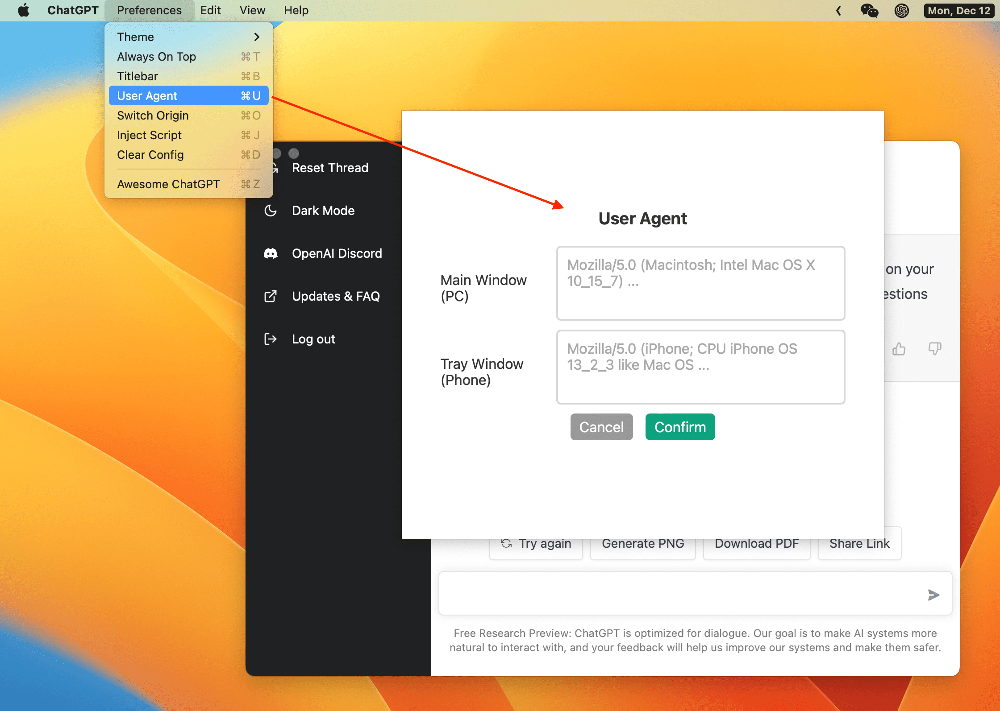

<p align="center">
  
  <h1 align="center">ChatGPT</h1>
</p>

> ChatGPT Desktop Application

[](https://github.com/lencx/ChatGPT/releases)
[](https://twitter.com/lencx_)

[Awesome ChatGPT](./AWESOME.md)

## 📦 Downloads

[📝 Update Log](./UPDATE_LOG.md)

<!-- download start -->

**Latest:**

- `Mac`: [ChatGPT_0.2.0_x64.dmg](https://github.com/lencx/ChatGPT/releases/download/v0.2.0/ChatGPT_0.2.0_x64.dmg)
- `Linux`: [chat-gpt_0.2.0_amd64.deb](https://github.com/lencx/ChatGPT/releases/download/v0.2.0/chat-gpt_0.2.0_amd64.deb)
- `Windows`: [ChatGPT_0.2.0_x64_en-US.msi](https://github.com/lencx/ChatGPT/releases/download/v0.2.0/ChatGPT_0.2.0_x64_en-US.msi)

[Other version...](https://github.com/lencx/ChatGPT/releases)

<!-- download end -->

### Install

Easily install with _[Homebrew](https://brew.sh) ([Cask](https://docs.brew.sh/Cask-Cookbook)):_

~~~ sh
brew tap lencx/chatgpt https://github.com/lencx/ChatGPT.git
brew install --cask chatgpt --no-quarantine
~~~

Also, if you keep a _[Brewfile](https://github.com/Homebrew/homebrew-bundle#usage)_, you can add something like this:

~~~ rb
repo = "lencx/chatgpt"
tap repo, "https://github.com/#{repo}.git"
cask "popcorn-time", args: { "no-quarantine": true }
~~~

## ✨ Features

- multi-platform: `macOS` `Linux` `Windows`
- export ChatGPT history (PNG, PDF and Share Link)
- always on top (whether the window should always be on top of other windows)
- inject script
- auto updater
- app menu
- tray window
- shortcut

### Menu

- **Preferences**
  - `Theme` - `Light`, `Dark` (Only macOS and Windows are supported).
  - `Always On Top`: Window is always on top of other windows.
  - `Titlebar`: Only supports macOS.
  - `User Agent` ([#17](https://github.com/lencx/ChatGPT/issues/17)): Customize `user agent` to prevent security detection interception. Default is empty string.
  - `Inject Script`: User scripts that can modify web pages.
  - `Switch Origin` ([#14](https://github.com/lencx/ChatGPT/issues/14)): Modify website address, the default is `https://chat.openai.com`. Please ensure that the mirror address is consistent with the UI of the original URL, otherwise the export function will fail.
  - `Clear Config`: Clear all chatgpt configuration files (`path: ~/.chatgpt/*`), dangerous operation, please backup data.
  - `Restart ChatGPT`: After editing the injection script file, you can restart the application through this menu item to make the script take effect.
  - `Awesome ChatGPT`: Related resources recommended.
- **Edit** - `Undo`, `Redo`, `Cut`, `Copy`, `SelectAll`, ...
- **View** - `Go Back`, `Go Forward`, `Scroll to Top of Screen`, `Scroll to Bottom of Screen`, `Refresh the Screen`, ...
- **Help**
  - `Update Log`: ChatGPT app changelog.
  - `Report Bug`: Defects and Suggestions Feedback.
  - `Toggle Developer Tools`: Developer tools for debugging web pages.

## TODO

- web access capability ([#20](https://github.com/lencx/ChatGPT/issues/20))
- ...

## 👀 Preview

 
 
 

---

<a href="https://www.buymeacoffee.com/lencx" target="_blank"></a>

## ❓FAQ

### Can't open ChatGPT

If the application cannot be opened after the upgrade, please try to clear the configuration file, which is in the `~/.chatgpt/*` directory.

### Is it safe?

It's safe, just a wrapper for [OpenAI ChatGPT](https://chat.openai.com) website, no other data transfer exists (you can check the source code).

### Developer cannot be verified?

- [Open a Mac app from an unidentified developer](https://support.apple.com/en-sg/guide/mac-help/mh40616/mac)

### How do i build it?

#### PreInstall

- [Rust](https://www.rust-lang.org/)
- [VS Code](https://code.visualstudio.com/)
  - [rust-analyzer](https://marketplace.visualstudio.com/items?itemName=rust-lang.rust-analyzer)
  - [tauri](https://marketplace.visualstudio.com/items?itemName=tauri-apps.tauri-vscode)

#### Start

```bash
# step1:
git clone https://github.com/lencx/ChatGPT.git

# step2:
cd ChatGPT

# step3: install deps
yarn

# step4:
yarn dev

# step5:
# bundle path: src-tauri/target/release/bundle
yarn build
```

## ❤️ Thanks

- The share buttons code is copied directly from [@liady](https://github.com/liady) extension with minor modifications.

## Related

- [Tauri](https://tauri.app) - Build an optimized, secure, and frontend-independent application for multi-platform deployment.
- [ChatGPT](https://openai.com/blog/chatgpt) - ChatGPT: Optimizing Language Models for Dialogue.
- [ChatGPT Export and Share](https://github.com/liady/ChatGPT-pdf) - A Chrome extension for downloading your ChatGPT history to PNG, PDF or creating a sharable link.
