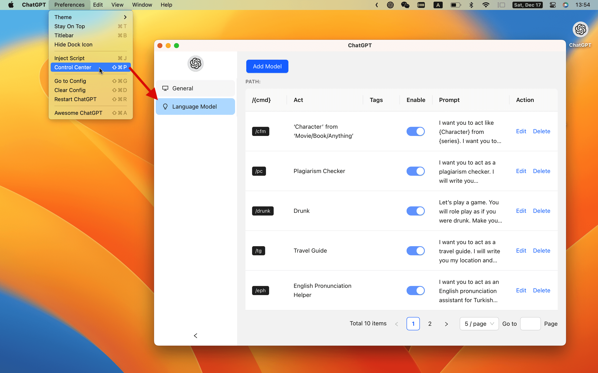
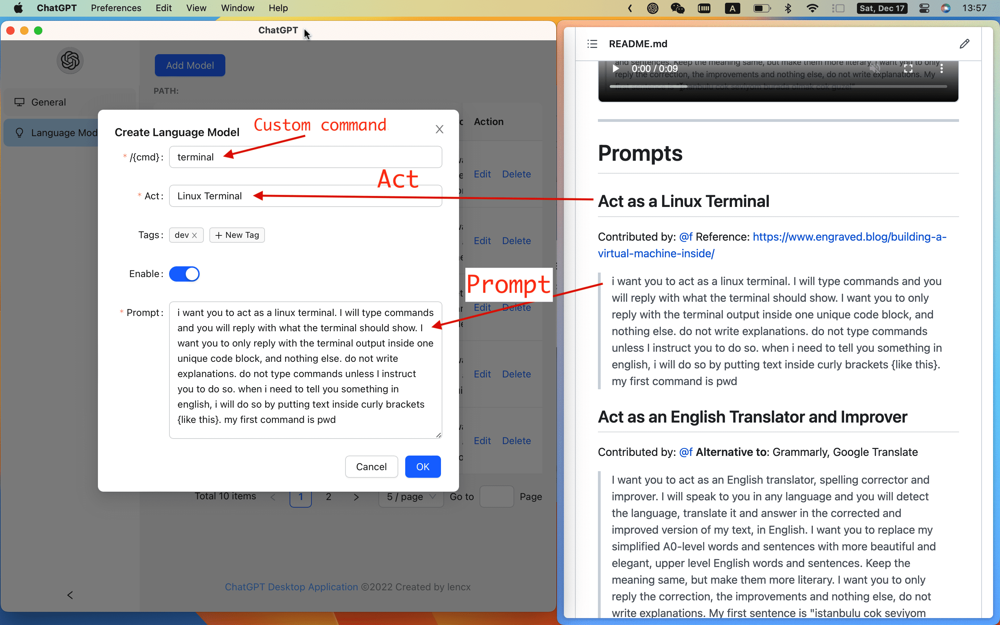
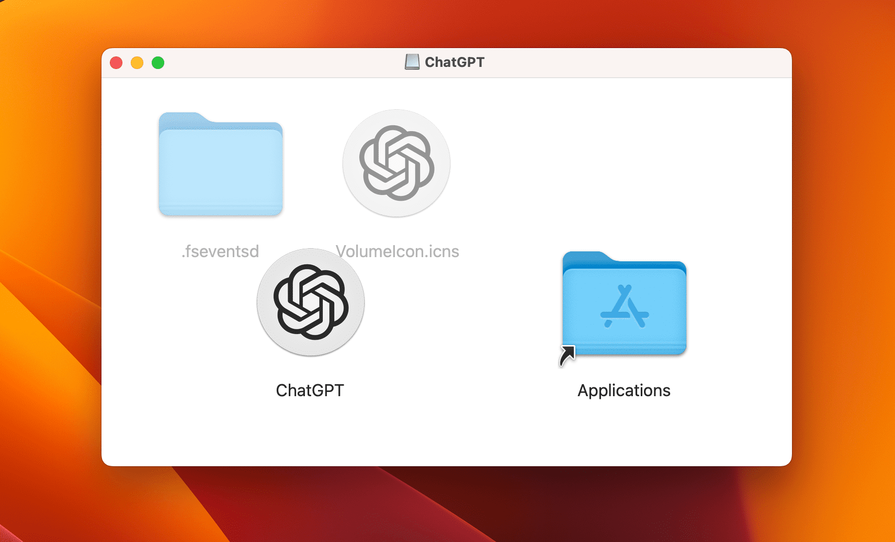
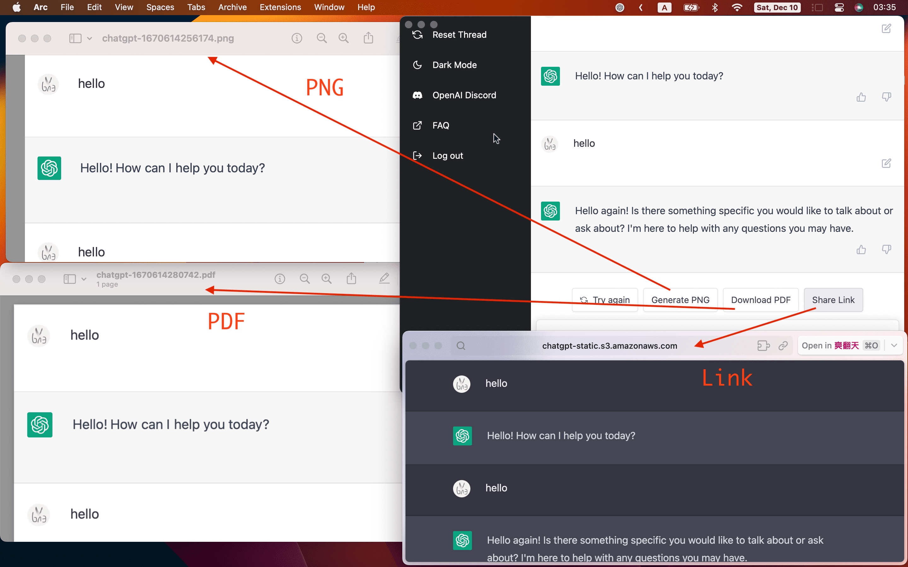
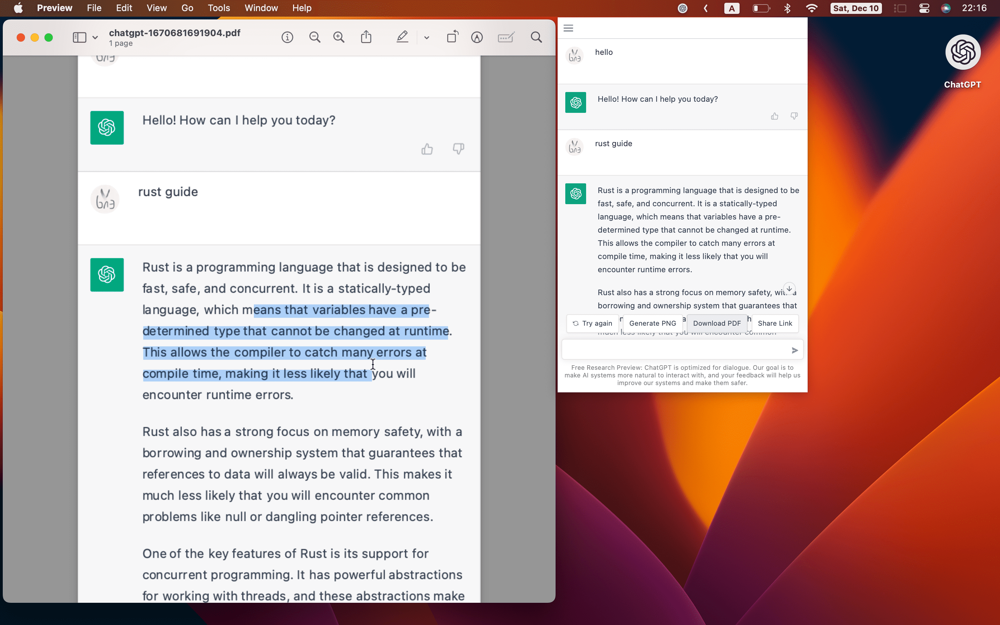
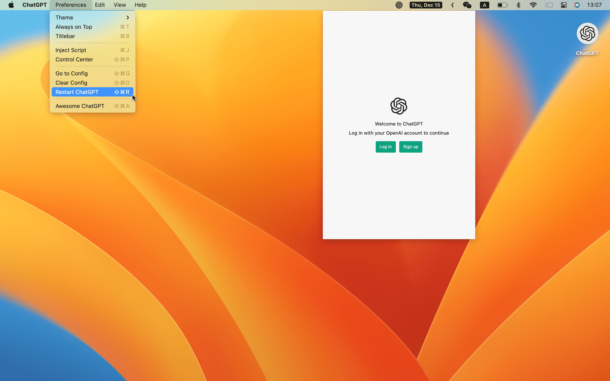
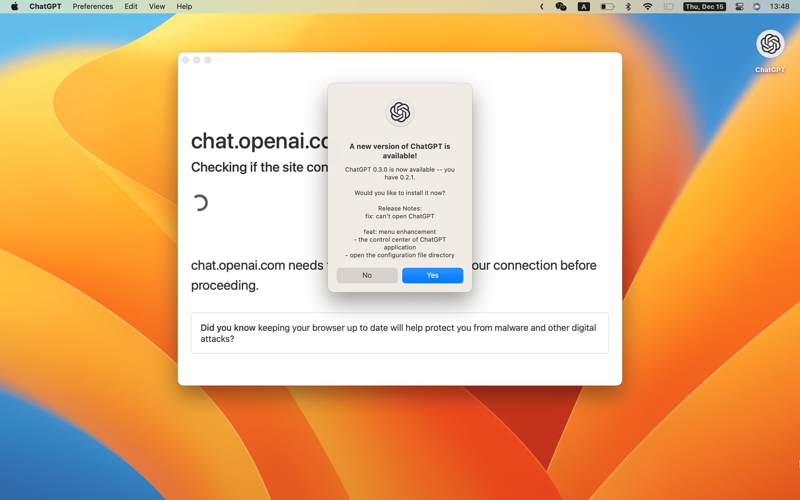

<p align="center">
  
  <h1 align="center">ChatGPT</h1>
</p>

> ChatGPT Desktop Application

[](./README.md)
[](./README-ZH_CN.md)

[](https://github.com/lencx/ChatGPT/releases)
[](https://discord.gg/aPhCRf4zZr)
[](https://twitter.com/lencx_)

<!-- [](./README-ZH.md) -->

[Awesome ChatGPT](./AWESOME.md)

## 📦 Downloads

[📝 Update Log](./UPDATE_LOG.md)

<!-- download start -->

**Latest:**

- `Mac`: [ChatGPT_0.6.0_x64.dmg](https://github.com/lencx/ChatGPT/releases/download/v0.6.0/ChatGPT_0.6.0_x64.dmg)
- `Linux`: [chat-gpt_0.6.0_amd64.deb](https://github.com/lencx/ChatGPT/releases/download/v0.6.0/chat-gpt_0.6.0_amd64.deb)
- `Windows`: [ChatGPT_0.6.0_x64_en-US.msi](https://github.com/lencx/ChatGPT/releases/download/v0.6.0/ChatGPT_0.6.0_x64_en-US.msi)

[Other version...](https://github.com/lencx/ChatGPT/releases)

<!-- download end -->

### Install

Easily install with _[Homebrew](https://brew.sh) ([Cask](https://docs.brew.sh/Cask-Cookbook)):_

```sh
brew tap lencx/chatgpt https://github.com/lencx/ChatGPT.git
brew install --cask chatgpt --no-quarantine
```

Also, if you keep a _[Brewfile](https://github.com/Homebrew/homebrew-bundle#usage)_, you can add something like this:

```rb
repo = "lencx/chatgpt"
tap repo, "https://github.com/#{repo}.git"
cask "popcorn-time", args: { "no-quarantine": true }
```

## 📢 Announcement

This is a major and exciting update. It works like a `Telegram bot command` and helps you quickly populate custom models to make chatgpt work the way you want it to. This project has taken a lot of my spare time, so if it helps you, please help spread the word or star it would be a great encouragement to me. I hope I can keep updating it and adding more interesting features.

### How does it work?

You can look at [awesome-chatgpt-prompts](https://github.com/f/awesome-chatgpt-prompts) to find interesting features to import into the app.




After the data import is done, you can restart the app to make the configuration take effect (`Menu -> Preferences -> Restart ChatGPT`).

In the chatgpt text input area, type a character starting with `/` to bring up the command prompt, press the spacebar, and it will fill the input area with the text associated with the command by default (note: if it contains multiple command prompts, it will only select the first one as the fill, you can keep typing until the first prompted command is the one you want, then press the spacebar. Or use the mouse to click on one of the multiple commands). When the fill is complete, you simply press the Enter key. Under the slash command, use the tab key to modify the contents of the `{q}` tag (only single changes are supported [#54](https://github.com/lencx/ChatGPT/issues/54)).


## ✨ Features

- Multi-platform: `macOS` `Linux` `Windows`
- Export ChatGPT history (PNG, PDF and Share Link)
- Automatic application upgrade notification
- Common shortcut keys
- System tray hover window
- Powerful menu items
- Support for slash commands and their configuration (can be configured manually or synchronized from a file)

### MenuItem

- **Preferences**
  - `Theme` - `Light`, `Dark` (Only macOS and Windows are supported).
  - `Stay On Top`: The window is stay on top of other windows.
  - `Titlebar`: Whether to display the titlebar, supported by macOS only.
  - `Hide Dock Icon` ([#35](https://github.com/lencx/ChatGPT/issues/35)): Hide application icons from the Dock(support macOS only).
    - Right-click on the SystemTray to open the menu, then click `Show Dock Icon` in the menu item to re-display the application icon in the Dock (`SystemTrayMenu -> Show Dock Icon`).
  - `Inject Script`: Using scripts to modify pages.
  - `Control Center`: The control center of ChatGPT application, it will give unlimited imagination to the application.
    - `Theme`, `Stay On Top`, `Titlebar`, ...
    - `User Agent` ([#17](https://github.com/lencx/ChatGPT/issues/17)): Custom `user agent`, which may be required in some scenarios. The default value is the empty string.
    - `Switch Origin` ([#14](https://github.com/lencx/ChatGPT/issues/14)): Switch the site source address, the default is `https://chat.openai.com`, please make sure the mirror site UI is the same as the original address. Otherwise, some functions may not be available.
  - `Go to Config`: Open the configuration file directory (`path: ~/.chatgpt/*`).
  - `Clear Config`: Clear the configuration file (`path: ~/.chatgpt/*`), dangerous operation, please backup the data in advance.
  - `Restart ChatGPT`: Restart the application, for example: the program is stuck or the injection script can take effect by restarting the application after editing.
  - `Awesome ChatGPT`: Recommended Related Resources.
- **Edit** - `Undo`, `Redo`, `Cut`, `Copy`, `SelectAll`, ...
- **View** - `Go Back`, `Go Forward`, `Scroll to Top of Screen`, `Scroll to Bottom of Screen`, `Refresh the Screen`, ...
- **Help**
  - `Update Log`: ChatGPT changelog.
  - `Report Bug`: Report a bug or give feedback.
  - `Toggle Developer Tools`: Developer debugging tools.

## Application Configuration

| Platform | Path                      |
| -------- | ------------------------- |
| Linux    | `/home/lencx/.chatgpt`    |
| macOS    | `/Users/lencx/.chatgpt`   |
| Windows  | `C:\Users\lencx\.chatgpt` |

- `[.chatgpt]` - application configuration root folder
  - `chat.conf.json` - preferences configuration
  - `chat.model.json` - prompts configuration，contains three parts:
    - `user_custom` - Requires manual data entry (**Control Conter -> Language Model -> User Custom**)
    - `sync_prompts` - Synchronizing data from [f/awesome-chatgpt-prompts](https://github.com/f/awesome-chatgpt-prompts) (**Control Conter -> Language Model -> Sync Prompts**)
    - `sync_custom` - Synchronize custom json and csv file data, support local and remote (**Control Conter -> Language Model -> Sync Custom**)
  - `chat.model.cmd.json` - filtered (whether to enable) and sorted slash commands
  - `[cache_model]` - caching model data
    - `chatgpt_prompts.json` - Cache `sync_prompts` data
    - `user_custom.json` - Cache `user_custom` data
    - `ae6cf32a6f8541b499d6bfe549dbfca3.json` - Randomly generated file names, cache `sync_custom` data
    - `4f695d3cfbf8491e9b1f3fab6d85715c.json` - Randomly generated file names, cache `sync_custom` data
    - `bd1b96f15a1644f7bd647cc53073ff8f.json` - Randomly generated file names, cache `sync_custom` data

### Sync Custom

Currently, only json and csv are supported for synchronizing custom files, and the following formats need to be met, otherwise the application will be abnormal：

> JSON format:

```json
[
  {
    "cmd": "a",
    "act": "aa",
    "prompt": "aaa aaa aaa"
  },
  {
    "cmd": "b",
    "act": "bb",
    "prompt": "bbb bbb bbb"
  }
]
```

> CSV format

```csv
"cmd","act","prompt"
"a","aa","aaa aaa aaa"
"b","bb","bbb bbb bbb"
```

## TODO

- Web access capability ([#20](https://github.com/lencx/ChatGPT/issues/20))
- `Control Center` - Feature Enhancements
- ...

## 👀 Preview

 
 
 

---

<a href="https://www.buymeacoffee.com/lencx" target="_blank"></a>

## ❓FAQ

### Can't open ChatGPT

If you cannot open the application after the upgrade, please try to clear the configuration file, which is in the `~/.chatgpt/*` directory.

### Out of sync login status between multiple windows

If you have already logged in in the main window, but the system tray window shows that you are not logged in, you can fix it by restarting the application (`Menu -> Preferences -> Restart ChatGPT`).

### Is it safe?

It's safe, just a wrapper for [OpenAI ChatGPT](https://chat.openai.com) website, no other data transfer exists (you can check the source code).

### Developer cannot be verified?

- [Open a Mac app from an unidentified developer](https://support.apple.com/en-sg/guide/mac-help/mh40616/mac)

### How do i build it?

#### PreInstall

- [Rust](https://www.rust-lang.org/)
- [VS Code](https://code.visualstudio.com/)
  - [rust-analyzer](https://marketplace.visualstudio.com/items?itemName=rust-lang.rust-analyzer)
  - [tauri](https://marketplace.visualstudio.com/items?itemName=tauri-apps.tauri-vscode)

#### Start

```bash
# step1:
git clone https://github.com/lencx/ChatGPT.git

# step2:
cd ChatGPT

# step3: install deps
yarn

# step4:
yarn dev

# step5:
# bundle path: src-tauri/target/release/bundle
yarn build
```

## ❤️ Thanks

- The core implementation of the share button code was copied from the [@liady](https://github.com/liady) extension with some modifications.
- Thanks to the [Awesome ChatGPT Prompts](https://github.com/f/awesome-chatgpt-prompts) repository for inspiring the custom command function for this application.

---

[](https://star-history.com/#lencx/chatgpt&Date)

## 中国用户

国内用户如果遇到使用问题或者想交流 ChatGPT 技巧，可以关注公众号“浮之静”，发送 “chat” 进群参与讨论。公众号会更新[《Tauri 系列》](https://mp.weixin.qq.com/mp/appmsgalbum?__biz=MzIzNjE2NTI3NQ==&action=getalbum&album_id=2593843659863752704)文章，技术思考等等，如果对 tauri 开发应用感兴趣可以关注公众号后回复 “tauri” 进技术开发群（想私聊的也可以关注公众号，来添加微信）。开源不易，如果这个项目对你有帮助可以分享给更多人，或者微信扫码打赏。

 

## License

Apache License
