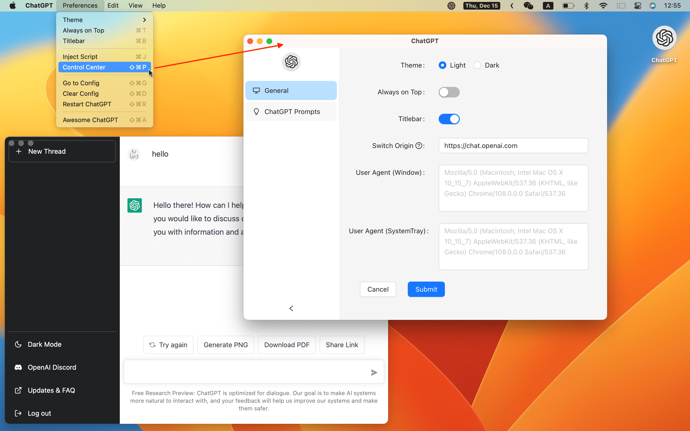

<p align="center">
  
  <h1 align="center">ChatGPT</h1>
</p>

> ChatGPT Desktop Application

[](./README.md)
[](./README-ZH.md)
[](https://github.com/lencx/ChatGPT/releases)
[](https://twitter.com/lencx_)

[Awesome ChatGPT](./AWESOME.md)

## 📦 Downloads

[📝 Update Log](./UPDATE_LOG.md)

<!-- download start -->

**Latest:**

- `Mac`: [ChatGPT_vv0.3.0_x64.dmg](https://github.com/lencx/ChatGPT/releases/download/vvv0.3.0/ChatGPT_vv0.3.0_x64.dmg)
- `Linux`: [chat-gpt_vv0.3.0_amd64.deb](https://github.com/lencx/ChatGPT/releases/download/vvv0.3.0/chat-gpt_vv0.3.0_amd64.deb)
- `Windows`: [ChatGPT_vv0.3.0_x64_en-US.msi](https://github.com/lencx/ChatGPT/releases/download/vvv0.3.0/ChatGPT_vv0.3.0_x64_en-US.msi)

[Other version...](https://github.com/lencx/ChatGPT/releases)

<!-- download end -->

### Install

Easily install with _[Homebrew](https://brew.sh) ([Cask](https://docs.brew.sh/Cask-Cookbook)):_

~~~ sh
brew tap lencx/chatgpt https://github.com/lencx/ChatGPT.git
brew install --cask chatgpt --no-quarantine
~~~

Also, if you keep a _[Brewfile](https://github.com/Homebrew/homebrew-bundle#usage)_, you can add something like this:

~~~ rb
repo = "lencx/chatgpt"
tap repo, "https://github.com/#{repo}.git"
cask "popcorn-time", args: { "no-quarantine": true }
~~~

## ✨ Features

- Multi-platform: `macOS` `Linux` `Windows`
- Export ChatGPT history (PNG, PDF and Share Link)
- Automatic application upgrade notification
- Common shortcut keys
- System tray hover window
- Powerful menu items

### MenuItem

- **Preferences**
  - `Theme` - `Light`, `Dark` (Only macOS and Windows are supported).
  - `Always on Top`: The window is always on top of other windows.
  - `Titlebar`: Whether to display the titlebar, supported by macOS only.
  - `Inject Script`: Using scripts to modify pages.
  - `Control Center`: The control center of ChatGPT application, it will give unlimited imagination to the application.
    - `Theme`, `Always on Top`, `Titlebar`, ...
    - `User Agent` ([#17](https://github.com/lencx/ChatGPT/issues/17)): Custom `user agent`, which may be required in some scenarios. The default value is the empty string.
    - `Switch Origin` ([#14](https://github.com/lencx/ChatGPT/issues/14)): Switch the site source address, the default is `https://chat.openai.com`, please make sure the mirror site UI is the same as the original address. Otherwise, some functions may not be available.
  - `Go to Config`: Open the configuration file directory (`path: ~/.chatgpt/*`).
  - `Clear Config`: Clear the configuration file (`path: ~/.chatgpt/*`), dangerous operation, please backup the data in advance.
  - `Restart ChatGPT`: Restart the application, for example: the program is stuck or the injection script can take effect by restarting the application after editing.
  - `Awesome ChatGPT`: Recommended Related Resources.
- **Edit** - `Undo`, `Redo`, `Cut`, `Copy`, `SelectAll`, ...
- **View** - `Go Back`, `Go Forward`, `Scroll to Top of Screen`, `Scroll to Bottom of Screen`, `Refresh the Screen`, ...
- **Help**
  - `Update Log`: ChatGPT changelog.
  - `Report Bug`: Report a bug or give feedback.
  - `Toggle Developer Tools`: Developer debugging tools.

## TODO

- Web access capability ([#20](https://github.com/lencx/ChatGPT/issues/20))
- Shortcut command typing chatgpt prompt
- ...

## 👀 Preview

 
 
 

---

<a href="https://www.buymeacoffee.com/lencx" target="_blank"></a>

## ❓FAQ

### Can't open ChatGPT

If you cannot open the application after the upgrade, please try to clear the configuration file, which is in the `~/.chatgpt/*` directory.

### Out of sync login status between multiple windows

If you have already logged in in the main window, but the system tray window shows that you are not logged in, you can fix it by restarting the application (`Menu -> Preferences -> Restart ChatGPT`).

### Is it safe?

It's safe, just a wrapper for [OpenAI ChatGPT](https://chat.openai.com) website, no other data transfer exists (you can check the source code).

### Developer cannot be verified?

- [Open a Mac app from an unidentified developer](https://support.apple.com/en-sg/guide/mac-help/mh40616/mac)

### How do i build it?

#### PreInstall

- [Rust](https://www.rust-lang.org/)
- [VS Code](https://code.visualstudio.com/)
  - [rust-analyzer](https://marketplace.visualstudio.com/items?itemName=rust-lang.rust-analyzer)
  - [tauri](https://marketplace.visualstudio.com/items?itemName=tauri-apps.tauri-vscode)

#### Start

```bash
# step1:
git clone https://github.com/lencx/ChatGPT.git

# step2:
cd ChatGPT

# step3: install deps
yarn

# step4:
yarn dev

# step5:
# bundle path: src-tauri/target/release/bundle
yarn build
```

## ❤️ Thanks

- The core implementation of the share button code was copied from the [@liady](https://github.com/liady) extension with some modifications.

---

[](https://star-history.com/#lencx/chatgpt&Date)

## License

Apache License
