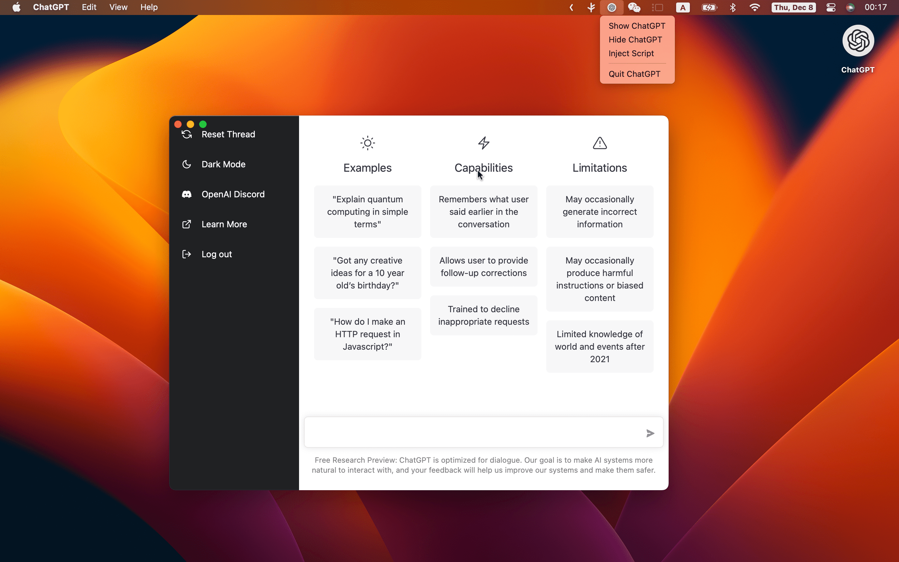

<p align="center">
  
  <h1 align="center">ChatGPT</h1>
</p>

> ChatGPT Desktop Application

[Awesome ChatGPT](./AWESOME.md)

## Downloads

[](https://github.com/lencx/ChatGPT/releases)

**Latest:**

- `Mac`: [ChatGPT_0.1.5_x64.dmg](https://github.com/lencx/ChatGPT/releases/download/v0.1.5/ChatGPT_0.1.5_x64.dmg)
- `Linux`: [chat-gpt_0.1.5_amd64.deb](https://github.com/lencx/ChatGPT/releases/download/v0.1.5/chat-gpt_0.1.5_amd64.deb)
- `Windows`: [ChatGPT_0.1.5_x64_en-US.msi](https://github.com/lencx/ChatGPT/releases/download/v0.1.5/ChatGPT_0.1.5_x64_en-US.msi)

[Other version...](https://github.com/lencx/ChatGPT/releases)

## Features

- multi-platform: `macOS` `Linux` `Windows`
- inject script
- auto updater
- app menu
- system tray
- shortcut

## Preview





## TODO

- [ ] export chat history
- [ ] ...

## FAQ

### Is it safe?

It's safe, just a wrapper for [OpenAI ChatGPT](https://chat.openai.com) website, no other data transfer exists (you can check the source code).

### How do i build it?

#### PreInstall

- [Rust](https://www.rust-lang.org/)
- [VS Code](https://code.visualstudio.com/)
  - [rust-analyzer](https://marketplace.visualstudio.com/items?itemName=rust-lang.rust-analyzer)
  - [tauri](https://marketplace.visualstudio.com/items?itemName=tauri-apps.tauri-vscode)

#### Start

```bash
# step1:
git clone https://github.com/lencx/ChatGPT.git

# step2:
cd ChatGPT

# step3: install deps
yarn

# step4:
yarn dev

# step5:
# bundle path: src-tauri/target/release/bundle
yarn build
```
