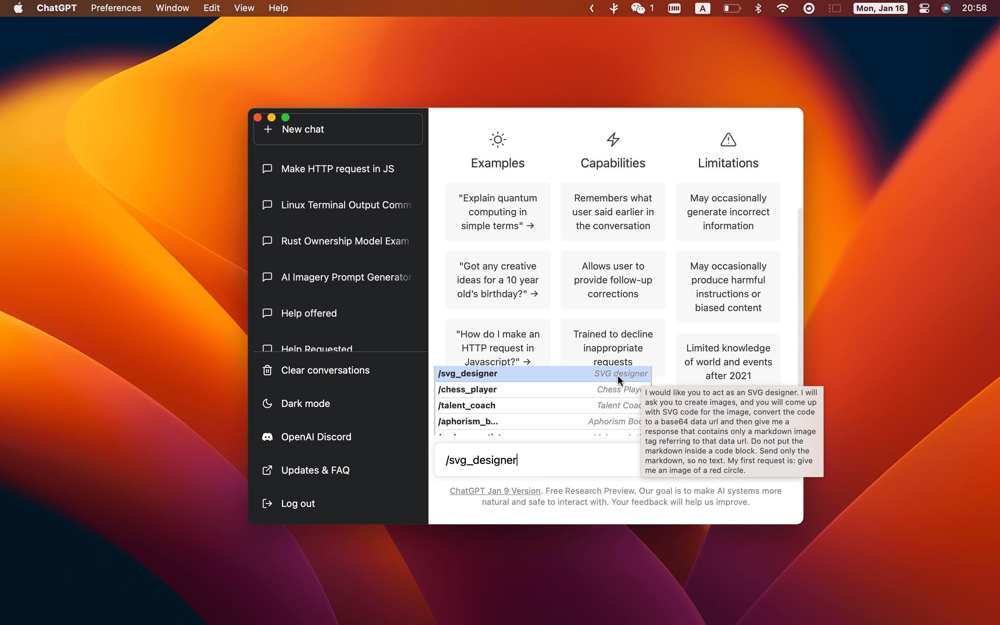

<p align="center">
  
  <h1 align="center">ChatGPT</h1>
  <p align="center">ChatGPT Desktop Application (Mac, Windows and Linux)</p>
</p>

[](./README.md)
[](./README-ZH_CN.md)\
[](https://github.com/lencx/ChatGPT/releases)
[](https://discord.gg/aPhCRf4zZr)
[](https://twitter.com/lencx_)

<a href="https://www.buymeacoffee.com/lencx" target="_blank"></a>

---

**It is an unofficial project intended for personal learning and research purposes only. During the time that the ChatGPT desktop application was open-sourced, it received a lot of attention, and I would like to thank everyone for their support. However, as things have developed, there are two issues that seriously affect the project's next development plan:**

- **Some people have used it for repackaging and selling for profit.**
- **The name and icon of ChatGPT may be involved in infringement issues.**

**New repository: https://github.com/lencx/nofwl**

---

## 📦 Install

- [📝 Update Log](./UPDATE_LOG.md)
- [🕒 History versions...](https://github.com/lencx/ChatGPT/releases)

<!-- tr-download-start -->

### Windows

- [ChatGPT_0.12.0_windows_x86_64.msi](https://github.com/lencx/ChatGPT/releases/download/v0.12.0/ChatGPT_0.12.0_windows_x86_64.msi): Direct download installer
- Use [winget](https://winstall.app/apps/lencx.ChatGPT):

  ```bash
  # install the latest version
  winget install --id=lencx.ChatGPT -e

  # install the specified version
  winget install --id=lencx.ChatGPT -e --version 0.10.0
  ```

**Note: If the installation path and application name are the same, it will lead to conflict ([#142](https://github.com/lencx/ChatGPT/issues/142#issuecomment-0.12.0))**

### Mac

- [ChatGPT_0.12.0_macos_aarch64.dmg](https://github.com/lencx/ChatGPT/releases/download/v0.12.0/ChatGPT_0.12.0_macos_aarch64.dmg): Direct download installer
- [ChatGPT_0.12.0_macos_x86_64.dmg](https://github.com/lencx/ChatGPT/releases/download/v0.12.0/ChatGPT_0.12.0_macos_x86_64.dmg): Direct download installer
- Homebrew \
  Or you can install with _[Homebrew](https://brew.sh) ([Cask](https://docs.brew.sh/Cask-Cookbook)):_
  ```sh
  brew tap lencx/chatgpt https://github.com/lencx/ChatGPT.git
  brew install --cask chatgpt --no-quarantine
  ```
  Also, if you keep a _[Brewfile](https://github.com/Homebrew/homebrew-bundle#usage)_, you can add something like this:
  ```rb
  repo = "lencx/chatgpt"
  tap repo, "https://github.com/#{repo}.git"
  cask "chatgpt", args: { "no-quarantine": true }
  ```

**If you encounter the error message `"ChatGPT" is damaged and can't be opened. You should move it to the Trash`. while installing software on macOS, it may be due to security settings restrictions in macOS. To solve this problem, please try the following command in Terminal:**

```bash
sudo xattr -r -d com.apple.quarantine /YOUR_PATH/ChatGPT.app
```

### Linux

- [ChatGPT_0.12.0_linux_x86_64.deb](https://github.com/lencx/ChatGPT/releases/download/v0.12.0/ChatGPT_0.12.0_linux_x86_64.deb): Download `.deb` installer, advantage small size, disadvantage poor compatibility
- [ChatGPT_0.12.0_linux_x86_64.AppImage.tar.gz](https://github.com/lencx/ChatGPT/releases/download/v0.12.0/ChatGPT_0.12.0_linux_x86_64.AppImage.tar.gz): Works reliably, you can try it if `.deb` fails to run

<!-- tr-download-end -->

## ChatGPT Prompts!

You can look at **[awesome-chatgpt-prompts](https://github.com/f/awesome-chatgpt-prompts)** to find interesting features to import into the app. You can also use `Sync Prompts` to sync all in one click, and if you don't want certain prompts to appear in your slash commands, you can disable them.



## ✨ Features

- Multi-platform: `macOS` `Linux` `Windows`
- Text-to-Speech
- Export ChatGPT history (PNG, PDF and Markdown)
- Automatic application upgrade notification
- Common shortcut keys
- System tray hover window
- Powerful menu items
- Support for slash commands and their configuration (can be configured manually or synchronized from a file [#55](https://github.com/lencx/ChatGPT/issues/55))
- Customize global shortcuts ([#108](https://github.com/lencx/ChatGPT/issues/108))
- Pop-up Search ([#122](https://github.com/lencx/ChatGPT/issues/122) mouse selected content, no more than 400 characters): The application is built using Tauri, and due to its security restrictions, some of the action buttons will not work, so we recommend going to your browser.

## ❤️ Sponsors

### **ChatGPT-Powered Email Finding & Outreach at Scale**

[FinalScout](https://finalscout.com/?utm_source=github&utm_medium=lencx&utm_campaign=chatgpt): Extract valid email addresses from LinkedIn & craft tailored emails based on LinkedIn profile with ChatGPT, guaranteeing up to 98% email deliverability. Scale your outreach efforts and connect with potential customers or clients like never before. [Begin automating your email finding and writing process](https://finalscout.com/?utm_source=github&utm_medium=lencx&utm_campaign=chatgpt)

## Thanks

- The core implementation of the share button code was copied from the [@liady](https://github.com/liady) extension with some modifications.
- Thanks to the [Awesome ChatGPT Prompts](https://github.com/f/awesome-chatgpt-prompts) repository for inspiring the custom command function for this application.

---

[](https://star-history.com/#lencx/chatgpt&Timeline)

## 中国用户

国内用户如果遇到使用问题或者想交流 ChatGPT 技巧，可以关注公众号“浮之静”，发送 “chat” 进群参与讨论。公众号会更新[《Tauri 系列》](https://mp.weixin.qq.com/mp/appmsgalbum?__biz=MzIzNjE2NTI3NQ==&action=getalbum&album_id=2593843659863752704)文章，技术思考等等，如果对 tauri 开发应用感兴趣可以关注公众号后回复 “tauri” 进技术开发群（想私聊的也可以关注公众号，来添加微信）。开源不易，如果这个项目对你有帮助可以分享给更多人，或者微信扫码打赏。

 

<a href="https://t.zsxq.com/0bQikmcVw"></a>

## License

AGPL-3.0 License
