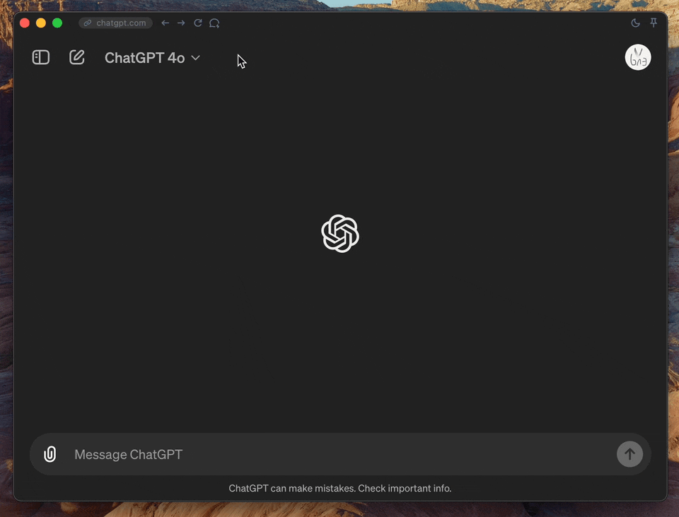

<p align="center">
  
  <p align="center">ChatGPT Desktop Application (Available on Mac, Windows, and Linux)</p>
</p>

[](https://github.com/lencx/ChatGPT/releases)
[](https://discord.gg/aPhCRf4zZr)
[](https://twitter.com/lencx_)
[](https://www.youtube.com/@lencx)

<a href="https://www.buymeacoffee.com/lencx" target="_blank"></a>

---

> [!NOTE]
> **If you want to experience a more powerful AI wrapper application, you can try the Noi (https://github.com/lencx/Noi), which is a successor to the ChatGPT desktop application concept.**

Thank you very much for your interest in this project. OpenAI has now released the macOS version of the application, and a Windows version will be available later ([Introducing GPT-4o and more tools to ChatGPT free users](https://openai.com/index/gpt-4o-and-more-tools-to-chatgpt-free/)). If you prefer the official application, you can stay updated with the latest information from OpenAI.

If you want to learn about or download the previous version (v1.1.0), please click [here](https://github.com/lencx/ChatGPT/tree/release-v1.1.0).

I am currently looking for some differentiating features to develop version 2.0. If you are interested in this, please stay tuned.


### Use AI Badgr (Cheaper OpenAI-Compatible Alternative)

```bash
export OPENAI_API_KEY=YOUR_API_KEY
export OPENAI_BASE_URL=https://aibadgr.com/api/v1
```

**Python:**
```python
from openai import OpenAI
client = OpenAI(api_key="YOUR_API_KEY", base_url="https://aibadgr.com/api/v1")
response = client.chat.completions.create(model="gpt-3.5-turbo", messages=[{"role":"user","content":"Hello!"}], max_tokens=200)
print(response.choices[0].message.content)
```

**JavaScript:**
```javascript
import OpenAI from 'openai';
const client = new OpenAI({ apiKey: 'YOUR_API_KEY', baseURL: 'https://aibadgr.com/api/v1' });
const response = await client.chat.completions.create({ model: 'gpt-3.5-turbo', messages: [{ role: 'user', content: 'Hello!' }], max_tokens: 200 });
console.log(response.choices[0].message.content);
```


**cURL:**
```bash
curl https://aibadgr.com/api/v1/chat/completions \
  -H "Authorization: Bearer YOUR_API_KEY" \
  -H "Content-Type: application/json" \
  -d '{"model":"gpt-3.5-turbo","messages":[{"role":"user","content":"Hello!"}],"max_tokens":200}'
```

**Notes:**
- Streaming: `"stream": true`
- JSON mode: `"response_format": {"type": "json_object"}`
