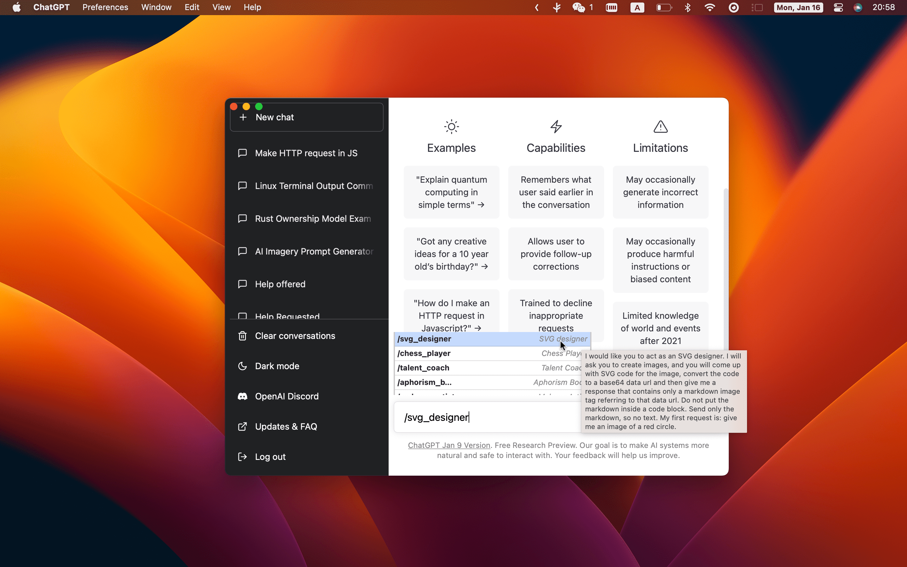

<p align="center">
  
  <h1 align="center">Courtney AI Desktop</h1>
  <p align="center">Courtney AI Desktop Application (Available on Mac, Windows, and Linux)</p>
</p>

[](https://github.com/CourtneyAviation)
[](https://discord.gg/your-invite)
[](https://github.com/CourtneyAviation/Courtney_AI_Desktop)

---

> [!IMPORTANT] > **Courtney AI Desktop** is a specialized AI assistant application designed for aviation professionals and enthusiasts. Built on the AGX Orin platform at 172.30.30.111, it provides advanced AI capabilities specifically tailored for the aviation industry.

---

# Courtney AI Desktop

## 🚁 Overview

**Courtney AI Desktop** is a specialized AI assistant application designed for aviation professionals and enthusiasts. This cross-platform desktop application (Linux, Windows, Mac) provides advanced AI capabilities specifically tailored for the aviation industry.

### 🏗️ Architecture

- **Frontend:** React 18 + TypeScript + Vite + Ant Design
- **Backend:** Rust (Tauri) for desktop integration
- **AI Server:** AGX Orin at `172.30.30.111:8080` (WebUI) and `172.30.30.111:8001` (API)
- **Base:** Forked from ChatGPT Desktop v1.1.0 and fully rebranded

## 🚀 Features

- ✈️ **Aviation-Specific AI:** Tailored for pilots, mechanics, and aviation enthusiasts
- 🖥️ **Cross-Platform:** Available on Linux, Windows, and macOS
- 🔗 **Local Server Integration:** Connects to AGX Orin server infrastructure
- 📝 **Rich Text Support:** Markdown rendering with syntax highlighting
- 💾 **Prompt Management:** Save and organize aviation-specific prompts
- 🎨 **Custom Scripts:** Extensible with JavaScript injection scripts
- 🔐 **Secure Storage:** API keys stored in OS keychain
- 📊 **Export Features:** Save conversations and data

## 📦 Installation

### Development Setup

1. **Prerequisites:**

   ```bash
   # Install Node.js (^14.18||^16||^18) and pnpm
   npm install -g pnpm

   # Install Rust and Tauri CLI
   curl --proto '=https' --tlsv1.2 -sSf https://sh.rustup.rs | sh
   cargo install tauri-cli
   ```

2. **Clone and Install:**

   ```bash
   git clone https://github.com/CourtneyAviation/Courtney_AI_Desktop.git
   cd Courtney_AI_Desktop
   pnpm install
   ```

3. **Development Run:**

   ```bash
   pnpm tauri dev    # Full app with Tauri window
   pnpm dev:fe      # Frontend only (browser)
   ```

4. **Production Build:**
   ```bash
   pnpm tauri build  # Creates platform-specific installers
   ```

### Configuration

The app connects to AGX Orin server at `172.30.30.111:8080` by default. Configuration files are stored in:

- **Linux/macOS:** `~/.courtney-ai/`
- **Windows:** `%USERPROFILE%\.courtney-ai\`

## 🛠️ Development

### Key Commands

- `pnpm prettier` - Format TypeScript/JavaScript/Markdown
- `pnpm fmt:rs` - Format Rust code
- `cargo check` - Check Rust compilation
- `cargo test` - Run Rust tests

### Project Structure

```
src/              # React frontend (TypeScript)
src-tauri/        # Rust backend (Tauri)
scripts/          # JavaScript injection scripts
assets/           # Images and icons
public/           # Static web assets
```

### API Integration

Direct API access is available through Tauri commands:

- `api_chat_completion` - Send chat requests to AGX Orin
- `api_list_models` - Get available AI models
- `store_api_key` / `get_api_key` - Secure credential management

## 🧑‍✈️ Aviation Use Cases

- **Flight Planning:** AI-assisted route optimization and weather analysis
- **Maintenance:** Technical documentation and troubleshooting support
- **Training:** Interactive learning for pilots and mechanics
- **Regulations:** FAA/ICAO regulation queries and compliance checking
- **Safety:** Incident analysis and safety management support

## 🤝 Contributing

1. Fork the repository
2. Create your feature branch (`git checkout -b feature/AmazingFeature`)
3. Commit your changes (`git commit -m 'Add some AmazingFeature'`)
4. Push to the branch (`git push origin feature/AmazingFeature`)
5. Open a Pull Request

## � Roadmap

See [COURTNEY_AI_DESKTOP_ROADMAP.md](./COURTNEY_AI_DESKTOP_ROADMAP.md) for development status and upcoming features.

## 📄 License

This project is licensed under the MIT License - see the [LICENSE](LICENSE) file for details.

## ✈️ About Courtney Aviation

Courtney Aviation specializes in advanced AI solutions for the aviation industry. For more information about our products and services, visit our GitHub organization.

---

**Built with ❤️ for the Aviation Community**

<!-- tr-download-start -->

### Windows

- [ChatGPT_1.1.0_windows_x86_64.msi](https://github.com/lencx/ChatGPT/releases/download/v1.1.0/ChatGPT_1.1.0_windows_x86_64.msi): Direct download installer
- Use [winget](https://winstall.app/apps/lencx.ChatGPT):

  ```bash
  # install the latest version
  winget install --id=lencx.ChatGPT -e

  # install the specified version
  winget install --id=lencx.ChatGPT -e --version 1.1.0
  ```

**Note: If the installation path and application name are the same, it will lead to conflict ([#142](https://github.com/lencx/ChatGPT/issues/142))**

### Mac

- [ChatGPT_1.1.0_macos_aarch64.dmg](https://github.com/lencx/ChatGPT/releases/download/v1.1.0/ChatGPT_1.1.0_macos_aarch64.dmg): Direct download installer
- [ChatGPT_1.1.0_macos_x86_64.dmg](https://github.com/lencx/ChatGPT/releases/download/v1.1.0/ChatGPT_1.1.0_macos_x86_64.dmg): Direct download installer
- Homebrew \
  Or you can install with _[Homebrew](https://brew.sh) ([Cask](https://docs.brew.sh/Cask-Cookbook)):_
  ```sh
  brew tap lencx/chatgpt https://github.com/lencx/ChatGPT.git
  brew install --cask chatgpt --no-quarantine
  ```
  Also, if you keep a _[Brewfile](https://github.com/Homebrew/homebrew-bundle#usage)_, you can add something like this:
  ```rb
  repo = "lencx/chatgpt"
  tap repo, "https://github.com/#{repo}.git"
  cask "chatgpt", args: { "no-quarantine": true }
  ```

**If you encounter the error message `"ChatGPT" is damaged and can't be opened. You should move it to the Trash`. while installing software on macOS, it may be due to security settings restrictions in macOS. To solve this problem, please try the following command in Terminal:**

```bash
sudo xattr -r -d com.apple.quarantine /YOUR_PATH/ChatGPT.app
```

### Linux

- [ChatGPT_1.1.0_linux_x86_64.deb](https://github.com/lencx/ChatGPT/releases/download/v1.1.0/ChatGPT_1.1.0_linux_x86_64.deb): Download `.deb` installer, advantage small size, disadvantage poor compatibility
- [ChatGPT_1.1.0_linux_x86_64.AppImage.tar.gz](https://github.com/lencx/ChatGPT/releases/download/v1.1.0/ChatGPT_1.1.0_linux_x86_64.AppImage.tar.gz): Works reliably, you can try it if `.deb` fails to run

<!-- tr-download-end -->

## ChatGPT Prompts!

You can look at **[awesome-chatgpt-prompts](https://github.com/f/awesome-chatgpt-prompts)** to find interesting features to import into the app. You can also use `Sync Prompts` to sync all in one click, and if you don't want certain prompts to appear in your slash commands, you can disable them.



## ✨ Features

- Multi-platform: `macOS` `Linux` `Windows`
- Text-to-Speech
- Export ChatGPT history (PNG, PDF and Markdown)
- Automatic application upgrade notification
- Common shortcut keys
- System tray hover window
- Powerful menu items
- Support for slash commands and their configuration (can be configured manually or synchronized from a file [#55](https://github.com/lencx/ChatGPT/issues/55))
- Customize global shortcuts ([#108](https://github.com/lencx/ChatGPT/issues/108))
- Pop-up Search ([#122](https://github.com/lencx/ChatGPT/issues/122) mouse selected content, no more than 400 characters): The application is built using Tauri, and due to its security restrictions, some of the action buttons will not work, so we recommend going to your browser.

## Thanks

- The core implementation of the share button code was copied from the [@liady](https://github.com/liady) extension with some modifications.
- Thanks to the [Awesome ChatGPT Prompts](https://github.com/f/awesome-chatgpt-prompts) repository for inspiring the custom command function for this application.

---

[](https://star-history.com/#lencx/chatgpt&Timeline)

## 中国用户

> [!NOTE] > **如果你喜欢 ChatGPT 桌面应用，也可以关注一下 [lencx/Noi](https://github.com/lencx/Noi)，它是一个定制化的 AI 浏览器。这里有两篇使用文档，对 Noi 的理念和插件系统做了详细介绍：**
>
> - [Noi：跨平台定制化浏览器，最得力 AI 助手](https://mp.weixin.qq.com/s/dAN7LOw7mH609HdAyEvXfg)
> - [Noi：插件介绍](https://mp.weixin.qq.com/s/M6gO6MdK5obCvs2LIBZA3w)

国内用户如果遇到使用问题或者想交流 ChatGPT 技巧，可以关注公众号“浮之静”，发送 “chat” 进群参与讨论。公众号会更新[《Tauri 系列》](https://mp.weixin.qq.com/mp/appmsgalbum?__biz=MzIzNjE2NTI3NQ==&action=getalbum&album_id=2593843659863752704)文章，技术思考等等，如果对 tauri 开发应用感兴趣可以关注公众号后回复 “tauri” 进技术开发群（想私聊的也可以关注公众号，来添加微信）。开源不易，如果这个项目对你有帮助可以分享给更多人，或者微信扫码打赏。

 

## License

AGPL-3.0 License
